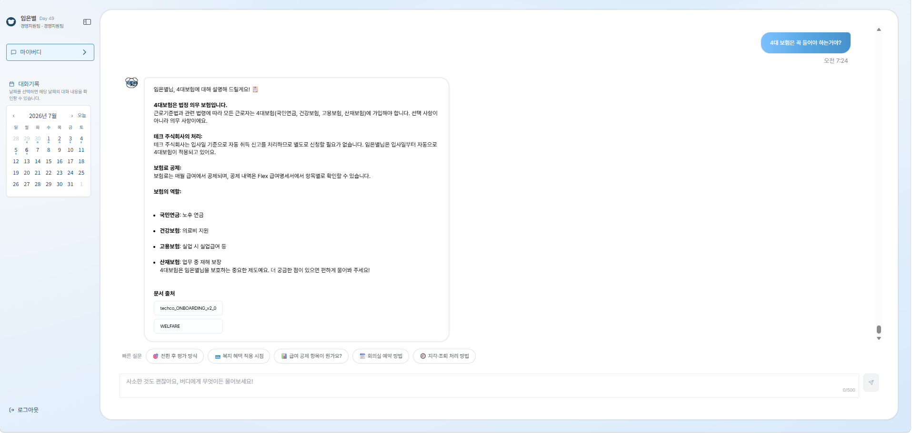

<div align="center">

# 🤝 WithBuddy AI

### RAG-powered HR Assistant for Enterprise Onboarding


**임직원이 사내 규정·복지·인사 정책을 자연어로 물어보면, 관련 문서를 검색해 근거 있는 답변을 실시간으로 제공하는 AI 어시스턴트입니다.**

> 📌 This repository is a **portfolio showcase**, not the source code.

</div>

---

## 📸 Screenshots

| 채팅 UI | 담당자 추천 카드 | 관리자 대시보드 |
|---------|----------------|----------------|
|  |  |  |

---

## 🗺 System Architecture


```
User Question
     │
     ▼
[Multi-Agent Orchestrator]  ← LangGraph (Intent 분류)
     │
     ├─ RAG ──────────────► [Hybrid Search]  ← BM25 + Vector (asyncio parallel)
     │                            │
     │                      [Claude Haiku]   ← SSE Streaming + Prompt Caching
     │                            │
     │                      [Quality Gate]   ← Self-Verifier + LLM Judge
     │
     ├─ chitchat ──────────► 일상 대화 처리
     ├─ out_of_scope ──────► 범위 외 안내
     └─ sensitive ─────────► 민감 질문 필터
```

---

## ✨ Key Features

### 🔍 Hybrid RAG Search
- **BM25 키워드 검색 + 벡터 의미 검색** 병렬 실행 후 점수 병합
- `kiwipiepy` 한국어 형태소 분석으로 BM25 색인 품질 개선
- 복합 질문 자동 분리 → 서브쿼리별 병렬 검색 → dedup 병합
- 쿼리 정규화 · 동의어 확장 · 멀티턴 컨텍스트 rewrite

### 🤖 Multi-Agent Orchestration
- LangGraph 기반 Intent 분류기 (RAG / chitchat / out_of_scope / sensitive)
- **1회 LLM 호출**로 Intent + Clarifying 동시 판별 (비용 최적화)
- 고위험 질문(해고 · 임금체불)은 LLM Judge 에이전트가 사후 검증

### ⚡ Async SSE Streaming
- FastAPI `asyncio` 기반 SSE 스트리밍으로 첫 토큰까지 **평균 0.7초**
- 120자 선행 버퍼로 `no_result` 조기 감지 후 고정 문구 교체
- `\x00` 스왑 방식으로 스트리밍 완료 후 최종 텍스트 단일 교체 (중복 방지)

### 🏢 Multi-Tenant Isolation
- `company_code` 메타데이터로 회사별 문서 공간 완전 격리
- 법령 문서(공통) / 사규 문서(회사 전용) 구분 저장
- 동일 AI 인프라에서 복수 기업 독립 운영

### 🛡 Quality Assurance Layer
- **Self-Verifier**: 문서 관련성 LLM 판정 (2회 연속 NO일 때만 차단, 오탐 방지)
- **LLM Judge**: 고위험 답변 스트리밍 억제 후 문서 대조 검증
- **미답변 감지**: 15개 키워드 패턴 → Slack 자동 알림 → 관리자 피드백 루프

### 💾 Prompt Caching
- 시스템 프롬프트 정적 블록에 `cache_control: ephemeral` 적용
- 반복 요청 시 캐시 재사용 → **입력 토큰 비용 절감**

---

## 👤 My Contributions

> AI 파트 전담 — 설계부터 배포까지 단독 구현

| 영역 | 내용 |
|------|------|
| **RAG 파이프라인** | 문서 인덱싱, 하이브리드 검색, 답변 생성 전체 설계 및 구현 |
| **Multi-Agent** | LangGraph Orchestrator, Self-Verifier, LLM Judge 구현 |
| **Prompt Engineering** | 멀티테넌트 시스템 프롬프트, Prompt Caching, 답변 품질 규칙 설계 |
| **Async API** | FastAPI SSE 스트리밍 엔드포인트, 선행 버퍼 로직 |
| **평가 시스템** | RAGAS 자동 평가, LangSmith 트레이싱, E2E 회귀 테스트 설계 |
| **미답변 관리** | 감지 → 저장 → 군집화 → Slack 알림 → 관리자 루프 전체 |
| **문서 인덱싱** | content_hash 변경 감지 기반 자동 재인덱싱, 버전 관리 |

---

## 🛠 Tech Stack

| Category | Technology |
|----------|-----------|
| **Language** | Python 3.11 |
| **LLM** | Claude Haiku (Anthropic) |
| **Embedding** | Google Gemini Embedding 2 · 3072d |
| **RAG Framework** | LangChain, LangGraph |
| **Vector DB** | ChromaDB |
| **Keyword Search** | BM25 + kiwipiepy (Korean NLP) |
| **API Server** | FastAPI + asyncio |
| **Caching** | Anthropic Prompt Caching · Redis |
| **Evaluation** | RAGAS · E2E Python |
| **Monitoring** | Prometheus · LangSmith |
| **Notification** | Slack SDK |

---

## 📊 Project Outcomes

| 지표 | 결과 |
|------|------|
| E2E 정답률 | **97.5%** (39/40, 통합 테스트셋) |
| BM25 도입 효과 | **82.5% → 87.5%** (+5%p) |
| TTFT | 평균 **0.7초** |
| LLM 호출 최적화 | Intent + Clarifying 통합으로 **2 → 1회** |
| 지원 기업 수 | 멀티테넌트 구조로 **복수 기업** 동시 운영 |

---

## 💡 Lessons Learned

**RAG는 검색이 전부다**  
초기에는 프롬프트 튜닝에 집중했지만, 정답률 병목은 항상 검색 품질이었습니다. BM25 하이브리드 도입 후 키워드 매칭이 약한 케이스가 크게 줄었고, 한국어 형태소 분석이 BM25 성능에 직접적인 영향을 준다는 걸 체감했습니다.

**Prompt Engineering은 규칙이 아니라 제약이다**  
"~하세요" 식 지시보다 "~는 절대 금지입니다 + 올바른 형태 예시 제시"가 훨씬 효과적이었습니다. LLM은 금지 규칙만 있으면 비슷한 패턴을 변형해서 우회하지만, 정답 형태를 명시하면 수렴합니다.

**비결정성을 다루는 법**  
동일 질문이 어떤 날은 정답, 어떤 날은 no_result로 분류되는 문제를 겪었습니다. 원인은 LLM 온도와 누적된 conversationHistory였고, temperature=0 고정과 히스토리 10턴 제한으로 안정화했습니다.

**스트리밍과 품질 검증의 충돌**  
SSE 스트리밍은 이미 나간 토큰을 회수할 수 없어서, 고위험 질문의 품질 검증과 정면으로 충돌했습니다. 스트리밍 억제 → 전체 누적 → LLM Judge → 단일 전송 방식으로 해결했지만, UX와 안전성의 트레이드오프를 직접 설계하는 경험이었습니다.

---

<div align="center">

**WithBuddy AI** · Built with ❤️ · 2026.03 – 2026.07

</div>
